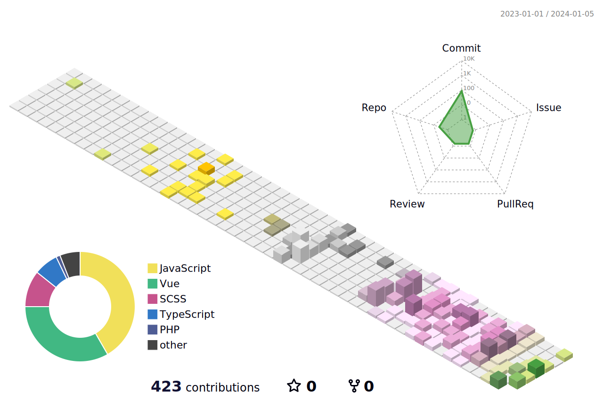

<h1> Hey! Nice to see you.</h1>

<p>I am a front-end engineer 🌱 , and also a full-stack developer, committed to become a good independent developer and open source contributor, recently interesting and practicing in lowcode, serverless, vite, SwiftUI, and Flutter。</p>

[](https://github.com/syakod)
[](https://juejin.cn/user/272334611548173)
[](https://syakod.com/)

### 🛠 Platforms, languages and tools

**Web Developer**


<p>
  
  
  
  
  
  
  
  
</p>

**Backend Developer**

<p>
  
  
  
  
  
</p>

**Android Developer**

<p>


</p>

**DevOps**

<p>
  
  
  
  
</p>

**Environment**

<p>
  
  
</p>

### 📫 Contact me:

- Website: [syakod.com](https://syakod.com/)
- Email: [hi@syakod.com](mailto:hi@syakod.com)
- Twitter: [@isyakod](https://twitter.com/isyakod)

You can also ask me a question on my [Public AMA](https://github.com/syakod/syakod/discussions/new?category=ama)

My GPG key hosted here at [GitHub](https://github.com/syakod.gpg) and also [Keybase](https://keybase.io/syakod/pgp_keys.asc), see [Keybase proof](https://gist.github.com/syakod/f8a09d7a4d90ad91ec836272ee08ed1e).



<details>
  <summary>:notebook: Some statistics ...</summary><br/>
  
<!--START_SECTION:waka-->


**🐱 My GitHub Data** 

> 📦 ? Used in GitHub's Storage 
 > 
> 🏆 233 Contributions in the Year 2023
 > 
> 💼 Opted to Hire
 > 
> 📜 2 Public Repositories 
 > 
> 🔑 0 Private Repositories 
 > 
**I'm a Night 🦉** 

```text
🌞 Morning                27 commits          ███░░░░░░░░░░░░░░░░░░░░░░   12.39 % 
🌆 Daytime                50 commits          ██████░░░░░░░░░░░░░░░░░░░   22.94 % 
🌃 Evening                137 commits         ████████████████░░░░░░░░░   62.84 % 
🌙 Night                  4 commits           ░░░░░░░░░░░░░░░░░░░░░░░░░   01.83 % 
```
📅 **I'm Most Productive on Saturday** 

```text
Monday                   20 commits          ██░░░░░░░░░░░░░░░░░░░░░░░   09.17 % 
Tuesday                  43 commits          █████░░░░░░░░░░░░░░░░░░░░   19.72 % 
Wednesday                20 commits          ██░░░░░░░░░░░░░░░░░░░░░░░   09.17 % 
Thursday                 23 commits          ███░░░░░░░░░░░░░░░░░░░░░░   10.55 % 
Friday                   35 commits          ████░░░░░░░░░░░░░░░░░░░░░   16.06 % 
Saturday                 46 commits          █████░░░░░░░░░░░░░░░░░░░░   21.10 % 
Sunday                   31 commits          ████░░░░░░░░░░░░░░░░░░░░░   14.22 % 
```


📊 **This Week I Spent My Time On** 

```text
🕑︎ Time Zone: Asia/Shanghai

💬 Programming Languages: 
No Activity Tracked This Week

🔥 Editors: 
No Activity Tracked This Week

💻 Operating System: 
No Activity Tracked This Week
```

**I Mostly Code in Swift** 

```text
Swift                    48 repos            ██████░░░░░░░░░░░░░░░░░░░   22.54 % 
TypeScript               42 repos            █████░░░░░░░░░░░░░░░░░░░░   19.72 % 
Vue                      37 repos            ████░░░░░░░░░░░░░░░░░░░░░   17.37 % 
Shell                    3 repos             ░░░░░░░░░░░░░░░░░░░░░░░░░   01.41 % 
Astro                    2 repos             ░░░░░░░░░░░░░░░░░░░░░░░░░   00.94 % 
```


 Last Updated on 26/04/2023 01:17:57 UTC
<!--END_SECTION:waka-->

<a href="https://github.com/syakod#gh-light-mode-only"></a>
<a href="https://github.com/syakod#gh-dark-mode-only"></a>
</details>
